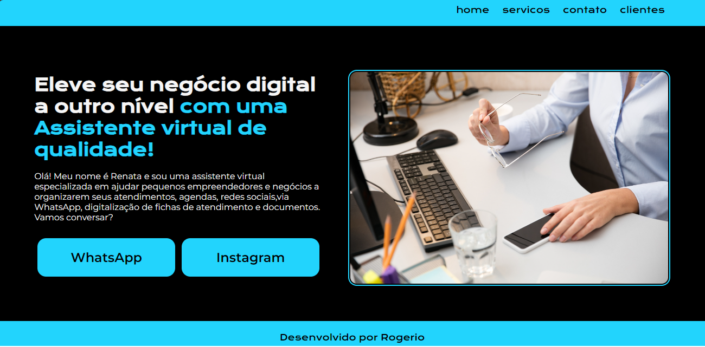
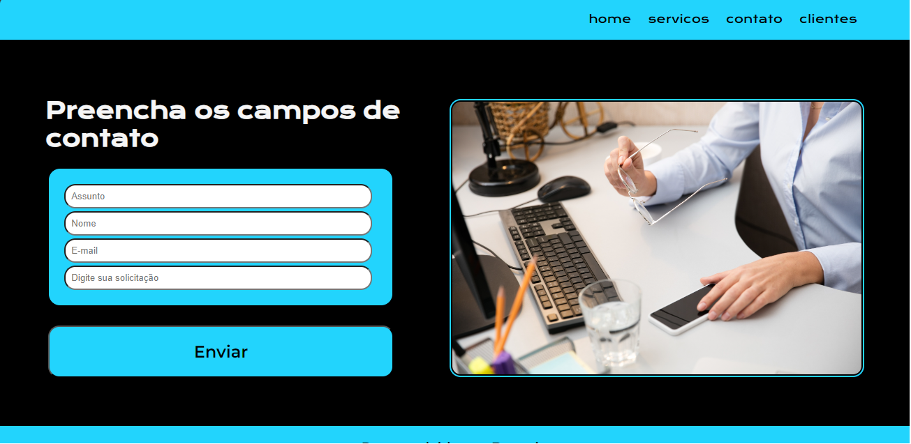

# Pagina web Virtual-Personalitte

Este projeto foi desenvolvido utilizando HTML5 e CSS3, a idéia é uma página com breve apresentação e botões de chamada para iteração dos usuários diretamente com o fornecedor de servços.

## Hospedagem / Deploy 

Para rodar este projeto ele está publicado em GitHub Pages com o link https://rogercorb.github.io/virtual-pernonalitte/

## Relatar um problema 

Caso haja qualquer problema de execução da página entre em contato com nosso help-desk.

## 🛠️ Construído com

## 💻 Telas do programa

## ✒️ Autor

Rogério Corbo

